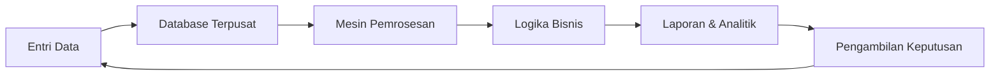
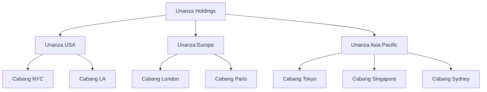
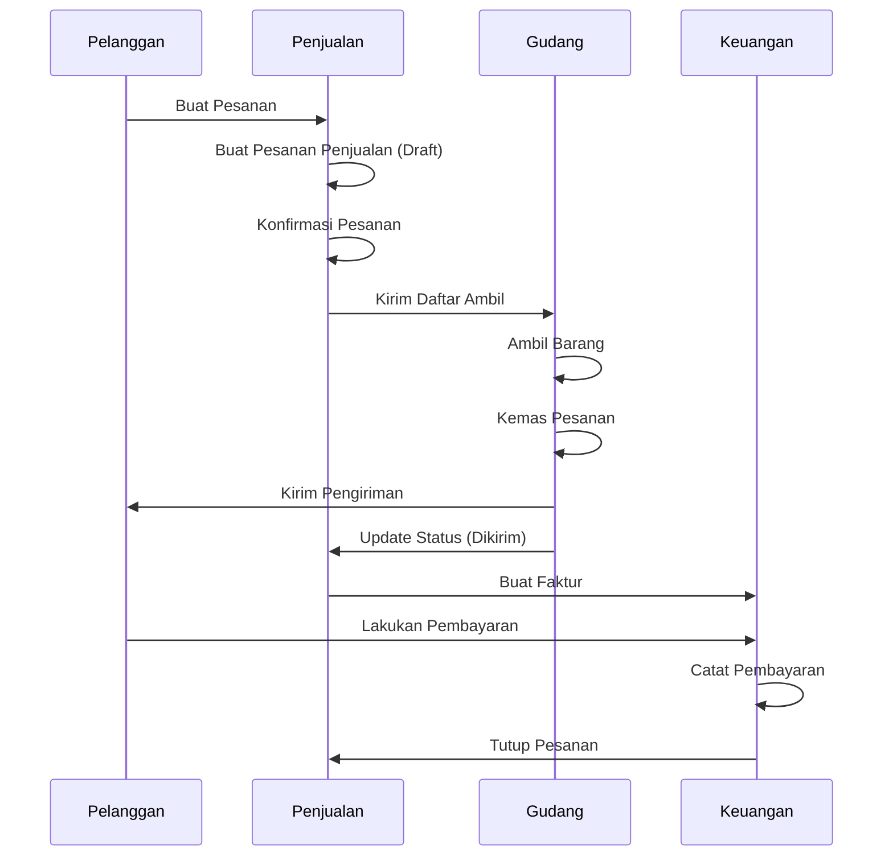
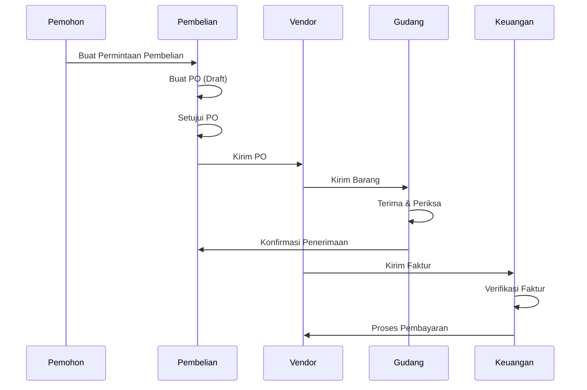
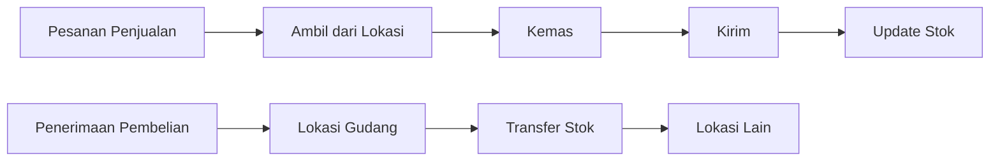
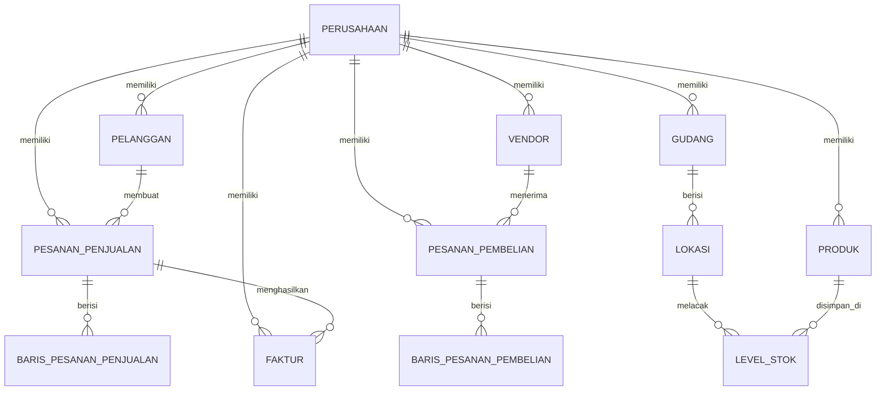

# Dokumentasi Sistem Enterprise Resource Planning (ERP)

## Daftar Isi
1. [Apa itu ERP?](#apa-itu-erp)
2. [Bagaimana Sistem ERP Bekerja](#bagaimana-sistem-erp-bekerja)
3. [Tinjauan Aplikasi](#tinjauan-aplikasi)
4. [Arsitektur Multi-Perusahaan](#arsitektur-multi-perusahaan)
5. [Modul Inti](#modul-inti)
6. [Alur Kerja Bisnis](#alur-kerja-bisnis)
7. [Model Data](#model-data)
8. [Arsitektur Teknis](#arsitektur-teknis)
9. [Panduan Pengguna](#panduan-pengguna)

---

## Apa itu ERP?

**Enterprise Resource Planning (ERP)** adalah jenis perangkat lunak yang digunakan organisasi untuk mengelola aktivitas bisnis sehari-hari seperti akuntansi, pengadaan, manajemen proyek, operasi rantai pasokan, dan manufaktur.

### Manfaat Utama Sistem ERP

- **Data Terpusat**: Satu sumber kebenaran untuk semua informasi bisnis
- **Otomasi Proses**: Mengurangi upaya manual dan kesalahan manusia
- **Visibilitas Real-time**: Akses instan ke metrik bisnis dan KPI
- **Kolaborasi Lebih Baik**: Departemen bekerja dari data yang sama
- **Kepatuhan Regulasi**: Kontrol dan jejak audit bawaan
- **Skalabilitas**: Berkembang sesuai kebutuhan bisnis Anda

### Prinsip Inti ERP

1. **Integrasi**: Semua modul berbagi database yang sama
2. **Otomasi**: Mengurangi tugas berulang
3. **Standarisasi**: Proses konsisten di seluruh organisasi
4. **Pemrosesan Real-time**: Pembaruan data langsung di semua modul

---

## Bagaimana Sistem ERP Bekerja

### Alur Kerja ERP



### Komponen Utama

1. **Lapisan Database**: Menyimpan semua data bisnis
2. **Lapisan Aplikasi**: Logika dan aturan bisnis
3. **Lapisan Presentasi**: Antarmuka pengguna
4. **Lapisan Integrasi**: Menghubungkan ke sistem eksternal

### Alur Proses ERP Umum

1. **Order to Cash (Pesanan ke Kas)**:
   - Pelanggan membuat pesanan → Pesanan penjualan dibuat
   - Gudang mengambil & mengemas → Pengiriman diproses
   - Faktur dibuat → Pembayaran diterima
   - Akun diperbarui secara otomatis

2. **Procure to Pay (Pengadaan ke Pembayaran)**:
   - Permintaan pembelian → Pesanan pembelian
   - Barang diterima → Pemeriksaan kualitas
   - Verifikasi faktur → Persetujuan pembayaran
   - Catatan keuangan diperbarui

---

## Tinjauan Aplikasi

### Apa itu Sistem ERP Ini?

Ini adalah **sistem ERP multi-perusahaan** yang dirancang untuk organisasi dengan beberapa entitas bisnis, anak perusahaan, dan cabang. Sistem ini menyediakan kemampuan manajemen bisnis yang komprehensif dengan isolasi data yang benar antar perusahaan.

### Fitur Utama

✅ **Dukungan Multi-Perusahaan**
- Kelola beberapa entitas hukum dari satu sistem
- Isolasi data per perusahaan
- Pelaporan konsolidasi lintas perusahaan
- Struktur perusahaan hierarkis (Holding → Anak Perusahaan → Cabang)

✅ **Modul Komprehensif**
- Manajemen Penjualan
- Manajemen Pembelian
- Manajemen Inventaris & Gudang
- Akuntansi Keuangan
- Manajemen Pelanggan & Vendor
- Manajemen Faktur

✅ **Arsitektur Modern**
- Frontend berbasis React
- TypeScript untuk keamanan tipe
- Pembaruan data real-time
- Desain responsif
- Kontrol akses berbasis peran

### Pengguna Target

- **Perusahaan Holding**: Tampilan konsolidasi di semua anak perusahaan
- **Anak Perusahaan**: Manajemen operasi regional
- **Cabang**: Unit operasional lokal
- **Bisnis Multi-lokasi**: Manajemen terpusat dengan otonomi lokal

---

## Arsitektur Multi-Perusahaan

### Hierarki Perusahaan



### Contoh Struktur Perusahaan

| ID Perusahaan | Tipe | Nama | Region |
|---------------|------|------|--------|
| comp-001 | Holding | Unanza Holdings | Global |
| comp-002 | Anak Perusahaan | Unanza USA | Amerika |
| comp-003 | Anak Perusahaan | Unanza Europe | EMEA |
| comp-004 | Anak Perusahaan | Unanza Asia Pacific | APAC |
| comp-005 | Cabang | Unanza NYC | Amerika Utara |
| comp-011 | Anak Perusahaan | TechGlobal UK | Eropa |
| comp-012 | Anak Perusahaan | TechGlobal France | Eropa |
| comp-013 | Anak Perusahaan | TechGlobal Japan | Asia |

### Model Isolasi Data

Setiap perusahaan memiliki **data yang benar-benar terisolasi**:

- ✅ Pelanggan sendiri
- ✅ Vendor sendiri
- ✅ Produk sendiri
- ✅ Gudang & inventaris sendiri
- ✅ Pesanan penjualan & pembelian sendiri
- ✅ Faktur sendiri
- ✅ Akun keuangan sendiri

**Manfaat**: Kepatuhan hukum, keamanan data, independensi operasional

---

## Modul Inti

### 1. Manajemen Penjualan

**Tujuan**: Mengelola seluruh proses penjualan dari penawaran hingga pengiriman.

**Fitur**:
- Pembuatan dan pelacakan pesanan penjualan
- Manajemen pelanggan
- Harga dan diskon
- Pelacakan status pesanan (Draft → Dikonfirmasi → Pengambilan → Dikemas → Dikirim)
- Integrasi dengan inventaris

**Alur Kerja**:
```
Pesanan Pelanggan → Pesanan Penjualan (Draft) → Konfirmasi → 
Pengambilan Gudang → Pengemasan → Pengiriman → Faktur
```

### 2. Manajemen Pembelian

**Tujuan**: Menangani pengadaan dari vendor.

**Fitur**:
- Permintaan pembelian
- Manajemen pesanan pembelian
- Manajemen vendor
- Penerimaan barang
- Pelacakan status (Draft → Dikonfirmasi → Menerima → Diterima)
- Integrasi dengan inventaris dan hutang usaha

**Alur Kerja**:
```
Permintaan Pembelian → Pesanan Pembelian → Vendor Mengirim → 
Barang Diterima → Pemeriksaan Kualitas → Tambah ke Inventaris → Pemrosesan Faktur
```

### 3. Manajemen Inventaris & Gudang

**Tujuan**: Melacak dan mengelola stok di beberapa gudang.

**Fitur**:
- Dukungan multi-gudang
- Lokasi gudang (zona, lorong, bin)
- Pelacakan level stok
- Manajemen titik pemesanan ulang
- Pergerakan stok (penerimaan, pengeluaran, transfer)
- Visibilitas inventaris real-time

**Konsep Utama**:
- **Gudang**: Fasilitas penyimpanan fisik
- **Lokasi**: Posisi spesifik dalam gudang (mis., Rak A-01-01)
- **Level Stok**: Kuantitas produk di setiap lokasi
- **Pergerakan**: Semua transaksi stok (masuk/keluar)

### 4. Akuntansi Keuangan

**Tujuan**: Mengelola catatan keuangan perusahaan.

**Fitur**:
- Bagan akun
- Buku besar umum
- Hutang usaha
- Piutang usaha
- Entri jurnal
- Pelaporan keuangan

### 5. Manajemen Pelanggan & Vendor

**Tujuan**: Memelihara data master untuk mitra bisnis.

**Manajemen Pelanggan**:
- Profil pelanggan
- Batas kredit
- Syarat pembayaran
- Riwayat transaksi
- Pelacakan nilai seumur hidup

**Manajemen Vendor**:
- Profil vendor
- Syarat pembayaran
- Kartu skor kinerja
- Riwayat pembelian

### 6. Manajemen Faktur

**Tujuan**: Menghasilkan dan melacak faktur pelanggan.

**Fitur**:
- Pembuatan faktur otomatis dari pesanan penjualan
- Berbagai status pembayaran (Belum Dibayar, Sebagian, Dibayar, Jatuh Tempo)
- Pelacakan pembayaran
- Laporan penuaan
- Integrasi dengan piutang usaha

---

## Alur Kerja Bisnis

### Siklus Lengkap Order-to-Cash



### Siklus Lengkap Procure-to-Pay



### Alur Kerja Pergerakan Inventaris



---

## Model Data

### Entitas Inti dan Hubungannya



### Tabel Data Utama

#### Perusahaan
- ID Perusahaan, Nama, Tipe (Holding/Anak Perusahaan/Cabang)
- Detail hukum, alamat, informasi pajak
- Hubungan hierarki

#### Produk
- ID Produk, SKU, Nama, Deskripsi
- Kategori, Unit Ukuran (UOM)
- Harga (Harga Beli, Harga Jual)
- Informasi stok (Qty on Hand, Reorder Point)
- **CompanyId** (terisolasi per perusahaan)

#### Gudang
- ID Gudang, Kode, Nama
- Alamat, Kota, Negara
- Tipe (Standar, Transit, Virtual)
- **CompanyId** (terisolasi per perusahaan)

#### Lokasi
- ID Lokasi, Kode, Nama
- ID Gudang, Zona
- Kapasitas, Tipe (Rak, Bin, Lantai, Rak)
- **CompanyId** (terisolasi per perusahaan)

#### Level Stok
- ID Level Stok
- ID Produk, ID Gudang, ID Lokasi
- Kuantitas, Min Level, Max Level
- **CompanyId** (terisolasi per perusahaan)

#### Pesanan Penjualan
- ID Pesanan, Nomor Pesanan
- ID Pelanggan, Tanggal Pesanan, Tanggal Pengiriman
- Status (Draft, Dikonfirmasi, Pengambilan, Dikemas, Dikirim)
- Total keuangan (Subtotal, Pajak, Total)
- **CompanyId** (terisolasi per perusahaan)

#### Pesanan Pembelian
- ID Pesanan, Nomor Pesanan
- ID Vendor, Tanggal Pesanan, Pengiriman Diharapkan
- Status (Draft, Dikonfirmasi, Menerima, Diterima)
- Total keuangan
- **CompanyId** (terisolasi per perusahaan)

#### Faktur
- ID Faktur, Nomor Faktur
- ID Pelanggan, Tanggal Faktur, Tanggal Jatuh Tempo
- Status (Belum Dibayar, Sebagian, Dibayar, Jatuh Tempo)
- Jumlah Dibayar, Jumlah Jatuh Tempo
- **CompanyId** (terisolasi per perusahaan)

---

## Arsitektur Teknis

### Stack Frontend

- **React 18**: Framework UI
- **TypeScript**: Pengembangan type-safe
- **Vite**: Build tool dan dev server
- **TanStack Query**: Pengambilan dan caching data
- **React Router**: Navigasi
- **Tailwind CSS**: Styling
- **Lucide React**: Ikon

### Manajemen State

```
┌─────────────────────────────────────┐
│       CompanyProvider               │
│   (Mengelola perusahaan aktif)      │
└─────────────┬───────────────────────┘
              │
              ▼
┌─────────────────────────────────────┐
│      MockDataProvider               │
│   (Filter data berdasarkan          │
│    activeCompanyId)                 │
└─────────────┬───────────────────────┘
              │
              ▼
┌─────────────────────────────────────┐
│    Komponen Aplikasi                │
│  (Menampilkan data perusahaan       │
│   yang difilter)                    │
└─────────────────────────────────────┘
```

### Alur Data

1. **Pengguna memilih perusahaan** → `CompanyProvider` memperbarui `activeCompanyId`
2. **MockDataProvider** memfilter semua data berdasarkan `activeCompanyId`
3. **Komponen** hanya menerima data perusahaan saat ini
4. **Operasi CRUD** secara otomatis menetapkan `activeCompanyId` ke record baru

### Fitur Teknis Utama

✅ **Filter Data Otomatis**
```typescript
const filteredProducts = activeCompanyId 
  ? products.filter(p => p.companyId === activeCompanyId) 
  : products;
```

✅ **Auto-Assignment saat Buat**
```typescript
const addProduct = (product) => {
  const newProduct = {
    ...product,
    companyId: activeCompanyId, // Auto-assigned
    id: generateId()
  };
  setProducts([...products, newProduct]);
};
```

✅ **Akses Berbasis Context**
```typescript
const { products, addProduct } = useMockData();
// Produk sudah difilter untuk perusahaan aktif
```

---

## Panduan Pengguna

### Memulai

#### 1. Pemilihan Perusahaan

Pemilih perusahaan di header memungkinkan Anda memilih data perusahaan mana yang ingin dilihat dan dikelola. Hanya data untuk perusahaan yang dipilih yang akan ditampilkan.

#### 2. Navigasi Utama

- **Dashboard**: Ikhtisar metrik utama
- **Penjualan**: Kelola pesanan penjualan dan pelanggan
- **Pembelian**: Tangani pesanan pembelian dan vendor
- **Inventaris**: Manajemen gudang dan stok
- **Keuangan**: Akuntansi dan faktur
- **Data Master**: Produk, pelanggan, vendor

### Tugas Umum

#### Membuat Pesanan Penjualan

1. Navigasi ke **Penjualan → Pesanan Penjualan**
2. Klik **"Pesanan Penjualan Baru"**
3. Pilih pelanggan
4. Tambahkan produk dan kuantitas
5. Tinjau harga dan total
6. Simpan sebagai **Draft** atau **Konfirmasi** langsung
7. Lacak status melalui: Dikonfirmasi → Pengambilan → Dikemas → Dikirim

#### Memproses Pesanan Pembelian

1. Navigasi ke **Pembelian → Pesanan Pembelian**
2. Klik **"Pesanan Pembelian Baru"**
3. Pilih vendor
4. Tambahkan item untuk dibeli
5. **Konfirmasi** untuk kirim ke vendor
6. Tandai sebagai **Menerima** saat barang tiba
7. Selesaikan penerimaan dan perbarui inventaris

#### Mengelola Inventaris

1. Navigasi ke **Inventaris → Gudang**
2. Pilih gudang
3. Lihat lokasi dan level stok
4. Lakukan penyesuaian stok sesuai kebutuhan
5. Pantau titik pemesanan ulang

#### Menghasilkan Faktur

1. Selesaikan pesanan penjualan (status: Dikirim)
2. Navigasi ke **Keuangan → Faktur**
3. Buat faktur dari pesanan penjualan
4. Kirim ke pelanggan
5. Lacak status pembayaran
6. Catat pembayaran yang diterima

### Operasi Multi-Perusahaan

#### Melihat Perusahaan Berbeda

1. Gunakan pemilih perusahaan di header
2. Pilih perusahaan target
3. Semua data otomatis difilter ke perusahaan tersebut
4. Lakukan operasi seperti biasa

#### Pelaporan Konsolidasi

Perusahaan holding dapat:
- Beralih antar semua anak perusahaan
- Lihat data konsolidasi
- Bandingkan kinerja antar entitas

---

## Praktik Terbaik

### Manajemen Data

✅ **Selalu verifikasi perusahaan aktif** sebelum membuat record
✅ **Gunakan konvensi penamaan yang konsisten** untuk kode dan nomor
✅ **Pertahankan titik pemesanan ulang yang akurat** untuk inventaris
✅ **Selesaikan alur kerja** (jangan biarkan pesanan dalam draft selamanya)
✅ **Rekonsiliasi faktur** secara teratur

### Optimasi Alur Kerja

1. **Penjualan-ke-Pengiriman**: Target siklus 24-48 jam
2. **Pembelian-ke-Penerimaan**: Lacak tanggal pengiriman yang diharapkan
3. **Faktur-ke-Pembayaran**: Syarat standar 30 hari
4. **Perputaran Inventaris**: Pantau item yang bergerak lambat

### Integritas Data

- **Rekonsiliasi Reguler**: Cocokkan inventaris dengan penghitungan fisik
- **Verifikasi Faktur**: Periksa silang dengan pesanan pembelian
- **Pelacakan Pembayaran**: Pantau laporan penuaan
- **Data Master**: Jaga info pelanggan/vendor tetap terkini

---

## Glosarium

| Istilah | Definisi |
|---------|----------|
| **ERP** | Enterprise Resource Planning |
| **SKU** | Stock Keeping Unit - identifikasi unik produk |
| **UOM** | Unit of Measure / Unit Ukuran (EA, KG, BOX, dll.) |
| **P.O.** | Purchase Order / Pesanan Pembelian |
| **S.O.** | Sales Order / Pesanan Penjualan |
| **Reorder Point** | Level stok yang memicu pemesanan ulang otomatis |
| **Lead Time** | Waktu dari pesanan hingga pengiriman |
| **Consolidated View** | Data gabungan di beberapa perusahaan |
| **Data Isolation** | Pemisahan data antar perusahaan |
| **Workflow Status** | Tahap saat ini dalam proses bisnis |

---

## Dukungan & Sumber Daya

### Referensi Cepat

- **Total Perusahaan**: 15 (2 holding, 6 anak perusahaan, 7 cabang)
- **Region yang Didukung**: Amerika, EMEA, APAC
- **Modul**: 6 modul inti
- **Status Alur Kerja**: 5 per modul (rata-rata)
- **Multi-mata uang**: Didukung melalui pengaturan perusahaan

### Dukungan Teknis

Untuk masalah teknis atau pertanyaan:
1. Periksa dokumentasi ini terlebih dahulu
2. Tinjau [Rencana Implementasi](file:///C:/Users/ASUS/.gemini/antigravity/brain/ce1ef1a9-d67c-448f-9326-2f8227a4871c/implementation_plan.md)
3. Konsultasikan [Walkthrough](file:///C:/Users/ASUS/.gemini/antigravity/brain/ce1ef1a9-d67c-448f-9326-2f8227a4871c/walkthrough.md)

---

## Lampiran: Ringkasan Data Mock

### Distribusi Data Mock Saat Ini

| Tipe Data | Total Record | Distribusi |
|-----------|--------------|------------|
| Perusahaan | 15 | 2 holding, 6 anak perusahaan, 7 cabang |
| Vendor | 15 | Didistribusikan di semua perusahaan |
| Pelanggan | 16 | Didistribusikan di semua perusahaan |
| Produk | 15 | 1 per perusahaan (perusahaan operasional) |
| Gudang | 18 | 1-3 per perusahaan operasional |
| Lokasi | 54 | 3 per gudang |
| Level Stok | 31 | Produk di lokasi gudang |
| Pesanan Penjualan | 30 | 5 per perusahaan utama |
| Pesanan Pembelian | 30 | 5 per perusahaan utama |
| Faktur | 28 | 3-5 per perusahaan utama |

**Total Record Mock**: ~250+ data uji komprehensif

---

*Sistem ERP ini menyediakan solusi lengkap dan siap produksi untuk manajemen bisnis multi-perusahaan. Semua modul sepenuhnya terintegrasi, memastikan konsistensi data dan efisiensi operasional di seluruh organisasi Anda.*
