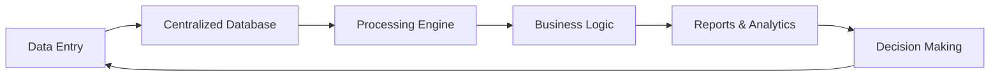
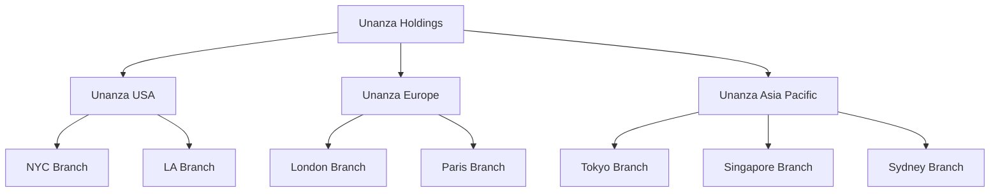
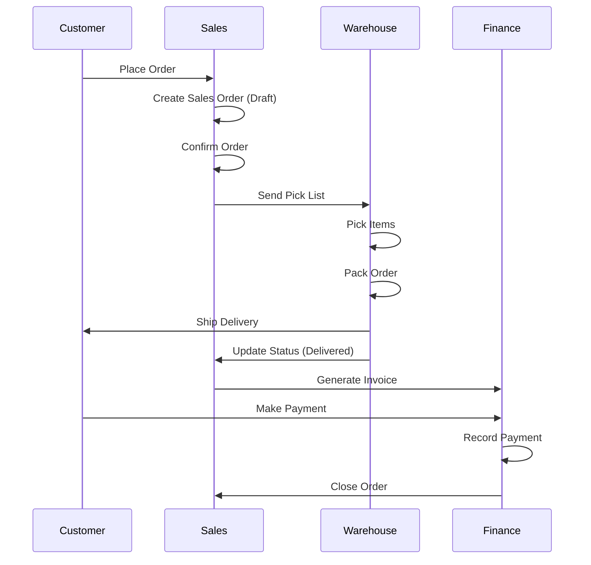
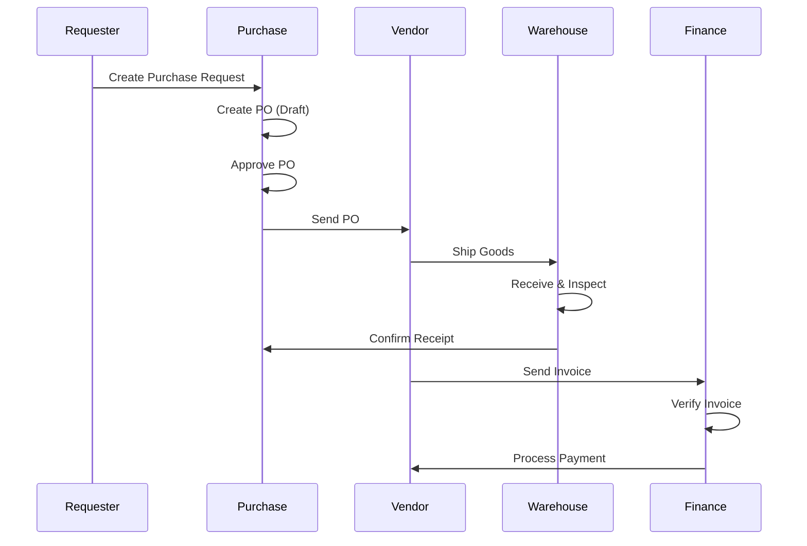
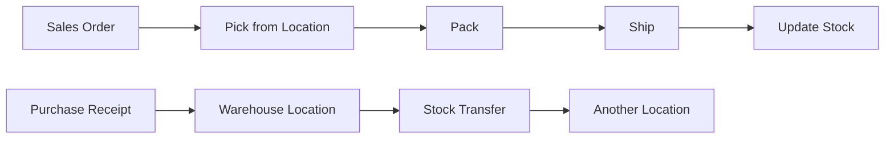
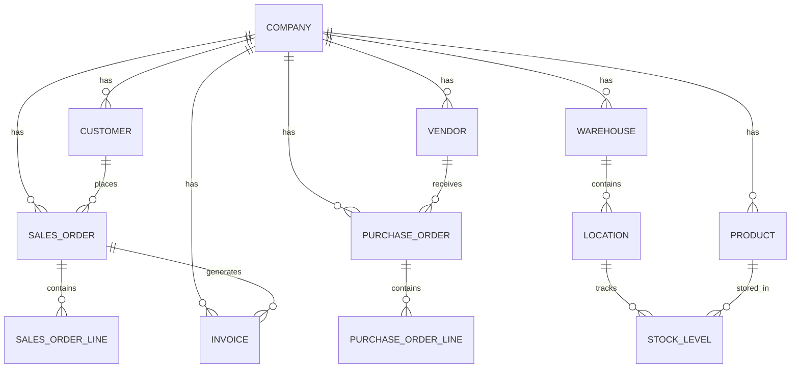

# Enterprise Resource Planning (ERP) System Documentation

## Table of Contents
1. [What is ERP?](#what-is-erp)
2. [How ERP Systems Work](#how-erp-systems-work)
3. [Application Overview](#application-overview)
4. [Multi-Company Architecture](#multi-company-architecture)
5. [Core Modules](#core-modules)
6. [Business Workflows](#business-workflows)
7. [Data Model](#data-model)
8. [Technical Architecture](#technical-architecture)
9. [User Guide](#user-guide)

---

## What is ERP?

**Enterprise Resource Planning (ERP)** is a type of software that organizations use to manage day-to-day business activities such as accounting, procurement, project management, supply chain operations, and manufacturing.

### Key Benefits of ERP Systems

- **Centralized Data**: Single source of truth for all business information
- **Process Automation**: Reduces manual effort and human error
- **Real-time Visibility**: Instant access to business metrics and KPIs
- **Improved Collaboration**: Departments work from the same data
- **Regulatory Compliance**: Built-in controls and audit trails
- **Scalability**: Grows with your business needs

### Core ERP Principles

1. **Integration**: All modules share a common database
2. **Automation**: Reduce repetitive tasks
3. **Standardization**: Consistent processes across the organization
4. **Real-time Processing**: Immediate data updates across modules

---

## How ERP Systems Work

### The ERP Workflow



### Key Components

1. **Database Layer**: Stores all business data
2. **Application Layer**: Business logic and rules
3. **Presentation Layer**: User interfaces
4. **Integration Layer**: Connects to external systems

### Typical ERP Process Flow

1. **Order to Cash**:
   - Customer places order → Sales Order created
   - Warehouse picks & packs → Delivery processed
   - Invoice generated → Payment received
   - Accounts updated automatically

2. **Procure to Pay**:
   - Purchase requisition → Purchase Order
   - Goods received → Quality check
   - Invoice verification → Payment approval
   - Financial records updated

---

## Application Overview

### What is This ERP System?

This is a **multi-company ERP system** designed for organizations with multiple business entities, subsidiaries, and branches. It provides comprehensive business management capabilities with true data isolation between companies.

### Key Features

✅ **Multi-Company Support**
- Manage multiple legal entities from one system
- Data isolation per company
- Consolidated reporting across companies
- Hierarchical company structures (Holdings → Subsidiaries → Branches)

✅ **Comprehensive Modules**
- Sales Management
- Purchase Management
- Inventory & Warehouse Management
- Financial Accounting
- Customer & Vendor Management
- Invoice Management

✅ **Modern Architecture**
- React-based frontend
- TypeScript for type safety
- Real-time data updates
- Responsive design
- Role-based access control

### Target Users

- **Holdings Companies**: Consolidated view across all subsidiaries
- **Subsidiaries**: Regional operations management
- **Branches**: Local operational units
- **Multi-location Businesses**: Centralized management with local autonomy

---

## Multi-Company Architecture

### Company Hierarchy



### Company Structure Example

| Company ID | Type | Name | Region |
|------------|------|------|--------|
| comp-001 | Holding | Unanza Holdings | Global |
| comp-002 | Subsidiary | Unanza USA | Americas |
| comp-003 | Subsidiary | Unanza Europe | EMEA |
| comp-004 | Subsidiary | Unanza Asia Pacific | APAC |
| comp-005 | Branch | Unanza NYC | North America |
| comp-011 | Subsidiary | TechGlobal UK | Europe |
| comp-012 | Subsidiary | TechGlobal France | Europe |
| comp-013 | Subsidiary | TechGlobal Japan | Asia |

### Data Isolation Model

Each company has **completely isolated data**:

- ✅ Own customers
- ✅ Own vendors
- ✅ Own products
- ✅ Own warehouses & inventory
- ✅ Own sales & purchase orders
- ✅ Own invoices
- ✅ Own financial accounts

**Benefit**: Legal compliance, data security, operational independence

---

## Core Modules

### 1. Sales Management

**Purpose**: Manage the entire sales process from quotation to delivery.

**Features**:
- Sales order creation and tracking
- Customer management
- Pricing and discounts
- Order status tracking (Draft → Confirmed → Picking → Packed → Delivered)
- Integration with inventory

**Workflow**:
```
Customer Order → Sales Order (Draft) → Confirmation → 
Warehouse Picking → Packing → Delivery → Invoice
```

### 2. Purchase Management

**Purpose**: Handle procurement from vendors.

**Features**:
- Purchase requisitions
- Purchase order management
- Vendor management
- Receiving goods
- Status tracking (Draft → Confirmed → Receiving → Received)
- Integration with inventory and accounts payable

**Workflow**:
```
Purchase Request → Purchase Order → Vendor Ships → 
Goods Received → Quality Check → Add to Inventory → Invoice Processing
```

### 3. Inventory & Warehouse Management

**Purpose**: Track and manage stock across multiple warehouses.

**Features**:
- Multi-warehouse support
- Warehouse locations (zones, aisles, bins)
- Stock level tracking
- Reorder point management
- Stock movements (receipts, issues, transfers)
- Real-time inventory visibility

**Key Concepts**:
- **Warehouses**: Physical storage facilities
- **Locations**: Specific positions within warehouses (e.g., Rack A-01-01)
- **Stock Levels**: Quantity of products at each location
- **Movements**: All stock transactions (in/out)

### 4. Financial Accounting

**Purpose**: Manage the company's financial records.

**Features**:
- Chart of accounts
- General ledger
- Accounts payable
- Accounts receivable
- Journal entries
- Financial reporting

### 5. Customer & Vendor Management

**Purpose**: Maintain master data for business partners.

**Customer Management**:
- Customer profiles
- Credit limits
- Payment terms
- Transaction history
- Lifetime value tracking

**Vendor Management**:
- Vendor profiles
- Payment terms
- Performance scorecards
- Purchase history

### 6. Invoice Management

**Purpose**: Generate and track customer invoices.

**Features**:
- Automatic invoice generation from sales orders
- Multiple payment statuses (Unpaid, Partial, Paid, Overdue)
- Payment tracking
- Aging reports
- Integration with accounts receivable

---

## Business Workflows

### Complete Order-to-Cash Cycle



### Complete Procure-to-Pay Cycle



### Inventory Movement Workflow



---

## Data Model

### Core Entities and Relationships



### Key Data Tables

#### Companies
- Company ID, Name, Type (Holding/Subsidiary/Branch)
- Legal details, addresses, tax information
- Hierarchy relationships

#### Products
- Product ID, SKU, Name, Description
- Category, Unit of Measure (UOM)
- Pricing (Purchase Price, Selling Price)
- Stock information (Qty on Hand, Reorder Point)
- **CompanyId** (isolated per company)

#### Warehouses
- Warehouse ID, Code, Name
- Address, City, Country
- Type (Standard, Transit, Virtual)
- **CompanyId** (isolated per company)

#### Locations
- Location ID, Code, Name
- Warehouse ID, Zone
- Capacity, Type (Rack, Bin, Floor, Shelf)
- **CompanyId** (isolated per company)

#### Stock Levels
- Stock Level ID
- Product ID, Warehouse ID, Location ID
- Quantity, Min Level, Max Level
- **CompanyId** (isolated per company)

#### Sales Orders
- Order ID, Order Number
- Customer ID, Order Date, Delivery Date
- Status (Draft, Confirmed, Picking, Packed, Delivered)
- Financial totals (Subtotal, Tax, Total)
- **CompanyId** (isolated per company)

#### Purchase Orders
- Order ID, Order Number
- Vendor ID, Order Date, Expected Delivery
- Status (Draft, Confirmed, Receiving, Received)
- Financial totals
- **CompanyId** (isolated per company)

#### Invoices
- Invoice ID, Invoice Number
- Customer ID, Invoice Date, Due Date
- Status (Unpaid, Partial, Paid, Overdue)
- Amount Paid, Amount Due
- **CompanyId** (isolated per company)

---

## Technical Architecture

### Frontend Stack

- **React 18**: UI framework
- **TypeScript**: Type-safe development
- **Vite**: Build tool and dev server
- **TanStack Query**: Data fetching and caching
- **React Router**: Navigation
- **Tailwind CSS**: Styling
- **Lucide React**: Icons

### State Management

```
┌─────────────────────────────────────┐
│       CompanyProvider               │
│   (Manages active company)          │
└─────────────┬───────────────────────┘
              │
              ▼
┌─────────────────────────────────────┐
│      MockDataProvider               │
│   (Filters data by activeCompanyId) │
└─────────────┬───────────────────────┘
              │
              ▼
┌─────────────────────────────────────┐
│    Application Components           │
│  (Display filtered company data)    │
└─────────────────────────────────────┘
```

### Data Flow

1. **User selects company** → `CompanyProvider` updates `activeCompanyId`
2. **MockDataProvider** filters all data by `activeCompanyId`
3. **Components** receive only current company's data
4. **CRUD operations** automatically assign `activeCompanyId` to new records

### Key Technical Features

✅ **Automatic Data Filtering**
```typescript
const filteredProducts = activeCompanyId 
  ? products.filter(p => p.companyId === activeCompanyId) 
  : products;
```

✅ **Auto-Assignment on Create**
```typescript
const addProduct = (product) => {
  const newProduct = {
    ...product,
    companyId: activeCompanyId, // Auto-assigned
    id: generateId()
  };
  setProducts([...products, newProduct]);
};
```

✅ **Context-Based Access**
```typescript
const { products, addProduct } = useMockData();
// Products are already filtered for active company
```

---

## User Guide

### Getting Started

#### 1. Company Selection

The company switcher in the header allows you to select which company's data to view and manage. Only data for the selected company will be displayed.

#### 2. Main Navigation

- **Dashboard**: Overview of key metrics
- **Sales**: Manage sales orders and customers
- **Purchase**: Handle purchase orders and vendors
- **Inventory**: Warehouse and stock management
- **Finance**: Accounting and invoices
- **Master Data**: Products, customers, vendors

### Common Tasks

#### Creating a Sales Order

1. Navigate to **Sales → Sales Orders**
2. Click **"New Sales Order"**
3. Select customer
4. Add products and quantities
5. Review pricing and totals
6. Save as **Draft** or **Confirm** immediately
7. Track status through: Confirmed → Picking → Packed → Delivered

#### Processing a Purchase Order

1. Navigate to **Purchase → Purchase Orders**
2. Click **"New Purchase Order"**
3. Select vendor
4. Add items to purchase
5. **Confirm** to send to vendor
6. Mark as **Receiving** when goods arrive
7. Complete receipt and update inventory

#### Managing Inventory

1. Navigate to **Inventory → Warehouses**
2. Select a warehouse
3. View locations and stock levels
4. Perform stock adjustments as needed
5. Monitor reorder points

#### Generating Invoices

1. Complete a sales order (status: Delivered)
2. Navigate to **Finance → Invoices**
3. Create invoice from sales order
4. Send to customer
5. Track payment status
6. Record payments as received

### Multi-Company Operations

#### Viewing Different Companies

1. Use company switcher in header
2. Select target company
3. All data automatically filters to that company
4. Perform operations normally

#### Consolidated Reporting

Holdings companies can:
- Switch between all subsidiaries
- View consolidated data
- Compare performance across entities

---

## Best Practices

### Data Management

✅ **Always verify the active company** before creating records
✅ **Use consistent naming conventions** for codes and numbers
✅ **Maintain accurate reorder points** for inventory
✅ **Complete workflows** (don't leave orders in draft indefinitely)
✅ **Reconcile invoices** regularly

### Workflow Optimization

1. **Sales-to-Delivery**: Target 24-48 hour cycle
2. **Purchase-to-Receipt**: Track expected delivery dates
3. **Invoice-to-Payment**: 30-day standard terms
4. **Inventory Turnover**: Monitor slow-moving items

### Data Integrity

- **Regular Reconciliation**: Match inventory to physical counts
- **Invoice Verification**: Cross-check with purchase orders
- **Payment Tracking**: Monitor aging reports
- **Master Data**: Keep customer/vendor info current

---

## Glossary

| Term | Definition |
|------|------------|
| **ERP** | Enterprise Resource Planning |
| **SKU** | Stock Keeping Unit - unique product identifier |
| **UOM** | Unit of Measure (EA, KG, BOX, etc.) |
| **P.O.** | Purchase Order |
| **S.O.** | Sales Order |
| **Reorder Point** | Stock level triggering automatic reorder |
| **Lead Time** | Time from order to delivery |
| **Consolidated View** | Combined data across multiple companies |
| **Data Isolation** | Separation of data between companies |
| **Workflow Status** | Current stage in business process |

---

## Support & Resources

### Quick Reference

- **Total Companies**: 15 (2 holdings, 6 subsidiaries, 7 branches)
- **Supported Regions**: Americas, EMEA, APAC
- **Modules**: 6 core modules
- **Workflow Statuses**: 5 per module (average)
- **Multi-currency**: Supported through company settings

### Technical Support

For technical issues or questions:
1. Check this documentation first
2. Review the [Implementation Plan](file:///C:/Users/ASUS/.gemini/antigravity/brain/ce1ef1a9-d67c-448f-9326-2f8227a4871c/implementation_plan.md)
3. Consult the [Walkthrough](file:///C:/Users/ASUS/.gemini/antigravity/brain/ce1ef1a9-d67c-448f-9326-2f8227a4871c/walkthrough.md)

---

## Appendix: Mock Data Summary

### Current Mock Data Distribution

| Data Type | Total Records | Distribution |
|-----------|---------------|--------------|
| Companies | 15 | 2 holdings, 6 subsidiaries, 7 branches |
| Vendors | 15 | Distributed across all companies |
| Customers | 16 | Distributed across all companies |
| Products | 15 | 1 per company (operational companies) |
| Warehouses | 18 | 1-3 per operational company |
| Locations | 54 | 3 per warehouse |
| Stock Levels | 31 | Products in warehouse locations |
| Sales Orders | 30 | 5 per major company |
| Purchase Orders | 30 | 5 per major company |
| Invoices | 28 | 3-5 per major company |

**Total Mock Records**: ~250+ comprehensive test data records

---

*This ERP system provides a complete, production-ready solution for multi-company business management. All modules are fully integrated, ensuring data consistency and operational efficiency across your entire organization.*
